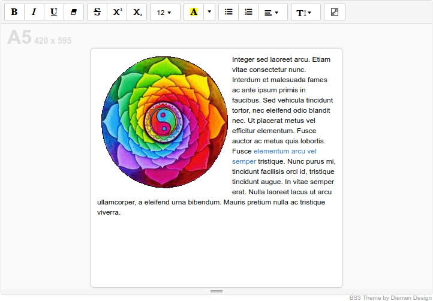

# summernote-paper-size

This Plugin adds a Paper-Size button to the Summernote toolbar that lets you change the editing view size to reflect Paper Sizes in Portrait format.



### Installation

#### 1. Include JS

Include the following code after Summernote:

```html
<script src="summernote-print-size.js"></script>
<script src="lang/[language-COUNTRY].js"></script>
```

#### 2. Supported languages

Supported languages can be found in the `lang` folder, and should be included after the plugin, then setting the chosen language when initialising Summernote.

#### 3. Summernote options

```javascript
$('.summernote').summernote({
    toolbar:[
        ['paperSize',['paperSize']], // The Button
        ['style',['style']],
        ['font',['bold','italic','underline','clear']],
        ['fontname',['fontname']],
        ['color',['color']],
        ['para',['ul','ol','paragraph']],
        ['height',['height']],
        ['table',['table']],
        ['insert',['media','link','hr']],
        ['view',['fullscreen','codeview']],
        ['help',['help']]
    ],
    save:{
      lang: 'en-US' // Change to your chosen language
    }
});
```

#### 4. Check out our other Summernote Plugins via our main Github page.
- [Diemen Design](https://github.com/DiemenDesign/)
